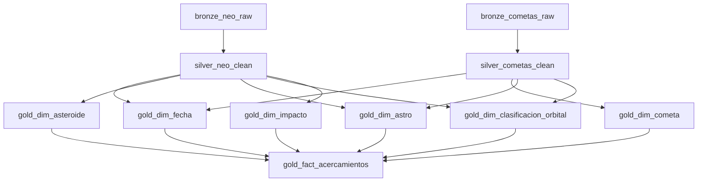

# 🌌 NASA Close Approaches Data Warehouse

> **Medallion Architecture ETL Pipeline** | Asteroids & Comets Near-Earth Data

A production-grade data engineering project that ingests, transforms, and models NASA's Near-Earth Object (NEO) and comet close-approach data using the medallion architecture pattern on Databricks.

---

## 🎯 Project Overview

This project implements a complete **ETL pipeline** that:
- 📡 Ingests raw data from NASA's NEO and SBDB APIs
- 🔄 Transforms and cleans data through bronze → silver → gold layers
- 📊 Builds a **star schema** dimensional model optimized for analytics
- ⚙️ Orchestrates the full pipeline via **Databricks Jobs**

**Tech Stack:** Databricks, Apache Spark, Delta Lake, Unity Catalog, SQL

---

## 📁 Project Structure

```
fact_approaches/
├── bronze/
│   ├── neo_raw.ipynb           # Ingest NEO asteroids (NASA API)
│   └── cometas_raw.ipynb       # Ingest comets (SBDB API)
├── silver/
│   ├── neo_clean.ipynb         # Clean & transform asteroids
│   └── cometas_clean.ipynb     # Clean & transform comets
├── gold/
│   ├── dim_fecha.ipynb         # Date dimension
│   ├── dim_asteroide.ipynb     # Asteroid catalog
│   ├── dim_cometa.ipynb        # Comet catalog
│   ├── dim_astro.ipynb         # Celestial body types
│   ├── dim_clasificacion_orbital.ipynb  # Orbital classifications
│   ├── dim_impacto.ipynb       # Impact hazard levels
│   └── fact_acercamientos.ipynb  # Unified fact table (approaches)
├── setup/
│   └── create_catalog.ipynb    # Unity Catalog initialization
└── README.md
```

---

## 🏗️ Medallion Architecture

### 🔶 Bronze Layer (Raw Ingestion)

**Purpose:** Land raw data from external APIs with minimal transformation.

**Notebooks:**
- `bronze/neo_raw` → `nasa_dw.bronze.neo_raw`
- `bronze/cometas_raw` → `nasa_dw.bronze.cometas_raw`

**Features:**
- Incremental ingestion with deduplication
- Ingestion timestamp tracking
- Schema-on-read (preserve raw structure)

**Data Sources:**
- [NASA NEO API](https://api.nasa.gov/) - Near-Earth Object feed
- [JPL SBDB Close-Approach API](https://ssd-api.jpl.nasa.gov/doc/cad.html) - Comet data

---

### 🔷 Silver Layer (Cleaned & Enriched)

**Purpose:** Apply data quality rules, type conversions, and business logic.

**Notebooks:**
- `silver/neo_clean` → `nasa_dw.silver.neo_clean`
- `silver/cometas_clean` → `nasa_dw.silver.cometas_clean`

**Transformations:**
- ✅ Data type casting (strings → dates, doubles)
- 🧮 Calculated fields:
  - Average diameter (km)
  - Distance in Lunar Units (LD)
  - Velocity conversions (km/h, km/s)
- 🏷️ Categorization:
  - Asteroid size classes (Small, Medium, Large, Very Large)
  - Comet orbital periods (Short, Long)
- 🔄 Deduplication via `QUALIFY ROW_NUMBER()`

---

### 🌟 Gold Layer (Star Schema)

**Purpose:** Business-ready dimensional model optimized for analytics.

#### 📐 Star Schema Design

```
                    ┌─────────────────┐
                    │  fact_          │
                    │  acercamientos  │
                    │                 │
                    │ • fecha_id      │
                    │ • cuerpo_id     │
                    │ • tipo_cuerpo   │
                    │ • distancia_km  │
                    │ • distancia_lu  │
                    │ • velocidad_kmh │
                    │ • clasificacion │
                    │ • impacto_id    │
                    └────────┬────────┘
                             │
         ┌───────────────────┼───────────────────┐
         │                   │                   │
┌────────▼────────┐ ┌────────▼────────┐ ┌────────▼────────┐
│   dim_fecha     │ │ dim_asteroide   │ │  dim_impacto    │
│                 │ │    OR           │ │                 │
│ • fecha_id (PK) │ │  dim_cometa     │ │ • impacto_id    │
│ • fecha (DATE)  │ │                 │ │ • nivel         │
│ • anio          │ │ • cuerpo_id     │ │ • descripcion   │
│ • mes           │ │ • nombre        │ │ • rango_lu      │
│ • nombre_mes    │ │ • diametro_km   │ └─────────────────┘
│ • dia_semana    │ │ • es_peligroso  │
└─────────────────┘ └─────────────────┘
         │
         │
┌────────▼────────────────┐
│ dim_clasificacion_      │
│      orbital            │
│                         │
│ • clasificacion_id      │
│ • nombre (Apollo, etc.) │
│ • descripcion           │
└─────────────────────────┘
```

#### 📊 Dimension Tables

| Table | Description | Key Attributes |
|-------|-------------|----------------|
| **dim_fecha** | Date dimension | `fecha_id` (YYYYMMDD), `fecha` (DATE), year, month, week, day |
| **dim_asteroide** | Asteroid catalog | `asteroide_id`, name, diameter, hazard flag, orbital class |
| **dim_cometa** | Comet catalog | `cometa_id`, name, period (short/long), magnitude |
| **dim_astro** | Body type lookup | Asteroid, Comet |
| **dim_clasificacion_orbital** | Orbital families | Apollo, Aten, Amor, etc. |
| **dim_impacto** | Hazard levels | Extreme (<0.1 LD), Very High, High, Moderate, Low |

#### 📈 Fact Table

**`fact_acercamientos`** - Unified close-approach events (asteroids + comets)

| Column | Type | Description |
|--------|------|-------------|
| `fecha_id` | INT | Date key (FK → dim_fecha) |
| `cuerpo_id` | STRING | Body ID (FK → dim_asteroide OR dim_cometa) |
| `tipo_cuerpo` | STRING | "Asteroide" or "Cometa" |
| `distancia_tierra_km` | DOUBLE | Distance to Earth (kilometers) |
| `distancia_tierra_lu` | DOUBLE | Distance to Earth (Lunar Distance) |
| `velocidad_kmh` | DOUBLE | Relative velocity (km/h) |
| `velocidad_kms` | DOUBLE | Relative velocity (km/s) |
| `cuerpo_orbitado` | STRING | Orbiting body (Earth, Sun) |
| `clasificacion_id` | INT | Orbital class (FK → dim_clasificacion_orbital) |
| `impacto_id` | INT | Hazard level (FK → dim_impacto) |
| `fecha_procesamiento` | TIMESTAMP | ETL timestamp |

---

## ⚙️ Pipeline Orchestration

### Databricks Job: `Pipeline fact_approaches - Bronze → Silver → Gold`

**Job ID:** `900191324987525`

**Execution Flow:**



**Task Dependencies:**
1. **Bronze** (parallel): `bronze_neo_raw` + `bronze_cometas_raw`
2. **Silver** (parallel): `silver_neo_clean` (after NEO) + `silver_cometas_clean` (after cometas)
3. **Gold Dimensions** (parallel): All 6 dimension tables (after Silver)
4. **Gold Fact** (sequential): `fact_acercamientos` (after all dimensions)

**Execution:** Serverless compute with automatic retry on failure.

---

## 🚀 Getting Started

### Prerequisites

- Databricks workspace (DBR 13.0+)
- Unity Catalog enabled
- NASA API Key ([Get one free](https://api.nasa.gov/))

### Setup

1. **Create Unity Catalog:**
   ```sql
   CREATE CATALOG IF NOT EXISTS nasa_dw;
   CREATE SCHEMA IF NOT EXISTS nasa_dw.bronze;
   CREATE SCHEMA IF NOT EXISTS nasa_dw.silver;
   CREATE SCHEMA IF NOT EXISTS nasa_dw.gold;
   ```

2. **Configure API Key:**
   - Edit `bronze/neo_raw` and `bronze/cometas_raw`
   - Replace `NASA_API_KEY` variable

3. **Run Pipeline:**
   - **Option A (Automated):** Trigger the Databricks Job
   - **Option B (Manual):** Execute notebooks in order (bronze → silver → gold)

---

## 📊 Example Queries

### 1. Top 20 Closest Approaches (All Time)

```sql
SELECT
    COALESCE(a.nombre, c.nombre) AS nombre_astro,
    f.tipo_cuerpo,
    d.fecha AS fecha_acercamiento,
    f.distancia_tierra_km,
    f.distancia_tierra_lu,
    f.velocidad_kmh
FROM nasa_dw.gold.fact_acercamientos f
JOIN nasa_dw.gold.dim_fecha d 
    ON d.fecha_id = f.fecha_id
LEFT JOIN nasa_dw.gold.dim_asteroide a 
    ON a.asteroide_id = f.cuerpo_id AND f.tipo_cuerpo = 'Asteroide'
LEFT JOIN nasa_dw.gold.dim_cometa c 
    ON c.cometa_id = f.cuerpo_id AND f.tipo_cuerpo = 'Cometa'
ORDER BY f.distancia_tierra_km ASC
LIMIT 20;
```

### 2. Hazard Level Distribution by Body Type

```sql
SELECT
    i.nivel AS hazard_level,
    f.tipo_cuerpo AS body_type,
    COUNT(*) AS total_approaches,
    ROUND(AVG(f.distancia_tierra_lu), 2) AS avg_distance_ld,
    ROUND(AVG(f.velocidad_kmh), 0) AS avg_velocity_kmh
FROM nasa_dw.gold.fact_acercamientos f
JOIN nasa_dw.gold.dim_impacto i 
    ON i.impacto_id = f.impacto_id
GROUP BY i.nivel, f.tipo_cuerpo
ORDER BY i.nivel, f.tipo_cuerpo;
```

### 3. Potentially Hazardous Asteroids (PHAs)

```sql
SELECT
    a.nombre,
    a.diametro_promedio_km,
    a.categoria_tamano,
    COUNT(*) AS total_approaches,
    MIN(f.distancia_tierra_lu) AS closest_approach_ld
FROM nasa_dw.gold.fact_acercamientos f
JOIN nasa_dw.gold.dim_asteroide a 
    ON a.asteroide_id = f.cuerpo_id
WHERE f.tipo_cuerpo = 'Asteroide'
  AND a.es_potencialmente_peligroso = TRUE
GROUP BY a.nombre, a.diametro_promedio_km, a.categoria_tamano
ORDER BY closest_approach_ld ASC;
```

### 4. Monthly Approach Trends

```sql
SELECT
    d.anio AS year,
    d.nombre_mes AS month,
    f.tipo_cuerpo AS body_type,
    COUNT(*) AS approaches
FROM nasa_dw.gold.fact_acercamientos f
JOIN nasa_dw.gold.dim_fecha d 
    ON d.fecha_id = f.fecha_id
GROUP BY d.anio, d.mes, d.nombre_mes, f.tipo_cuerpo
ORDER BY d.anio DESC, d.mes DESC;
```

### 5. Orbital Classification Breakdown (Asteroids)

```sql
SELECT
    o.nombre AS orbital_class,
    COUNT(*) AS total_approaches,
    ROUND(AVG(f.distancia_tierra_km), 0) AS avg_distance_km
FROM nasa_dw.gold.fact_acercamientos f
LEFT JOIN nasa_dw.gold.dim_clasificacion_orbital o 
    ON o.clasificacion_id = f.clasificacion_id
WHERE f.tipo_cuerpo = 'Asteroide'
GROUP BY o.nombre
ORDER BY total_approaches DESC;
```

---

## 🔧 Key Technical Features

### Delta Lake ACID Transactions
- All tables use **Delta format** for ACID guarantees
- Time travel enabled (`VERSION AS OF`, `TIMESTAMP AS OF`)

### Incremental Loading
- `MERGE` operations prevent duplicates in Bronze/Silver
- `INSERT OVERWRITE` for dimension tables (SCD Type 1)

### Data Quality
- `QUALIFY ROW_NUMBER()` for efficient deduplication
- `COALESCE()` to handle NULL propagation in JOINs
- Surrogate keys (e.g., `fecha_id = YYYYMMDD`) for performance

### Query Optimization
- Denormalized fact table reduces JOIN overhead
- Integer date keys (`fecha_id`) faster than DATE joins
- LEFT JOIN pattern for polymorphic relationships (Asteroid OR Comet)

---

## 📈 Future Enhancements

- [ ] **Streaming Ingestion:** Replace batch with Auto Loader for real-time updates
- [ ] **Data Quality Checks:** Integrate Great Expectations for validation
- [ ] **Partitioning:** Partition fact table by `fecha_id` for query performance
- [ ] **Lakeview Dashboard:** Build visualizations for hazard monitoring
- [ ] **Alerting:** Send notifications for high-risk approaches (<0.1 LD)
- [ ] **Additional APIs:** Integrate Mars Rovers, APOD, exoplanet data
- [ ] **SCD Type 2:** Track historical changes in dimension attributes

---

## 📄 License & Attribution

**Data Source:** [NASA Open APIs](https://api.nasa.gov/) - Public domain  
**Built with:** Databricks, Apache Spark, Delta Lake, Unity Catalog  
**Architecture Pattern:** Medallion (Bronze-Silver-Gold)

---

## 🤝 Contributing

For improvements, bug reports, or feature requests, please contact the Data Engineering team.

---

**Made with ☄️ by the Data Engineering Team**
